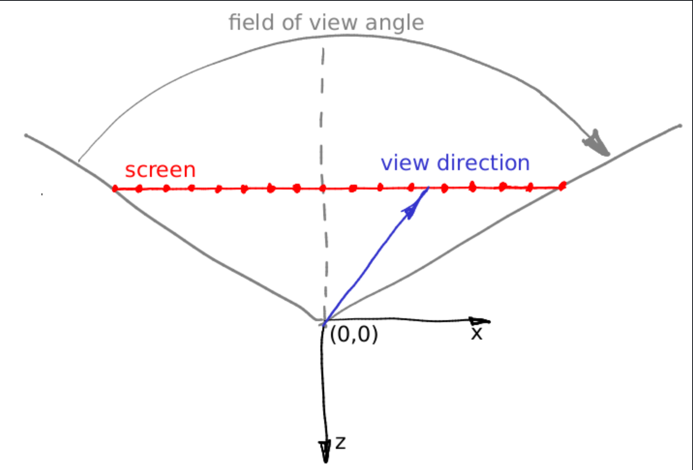

```c++
#include <cmath>
#include <iostream>
#include <vector>
#include "geometry.h"

#define STB_IMAGE_WRITE_IMPLEMENTATION

#include "stb_image_write.h"

struct Sphere {
    Vec3f center;
    float radius;

    Sphere(const Vec3f &c, const float &r) : center(c), radius(r) {}

    bool ray_intersect(const Vec3f &orig, const Vec3f &dir, float &t0) const {
        Vec3f L = center - orig;
        float tca = L * dir;
        float d2 = L * L - tca * tca;
        if (d2 > radius * radius) return false;
        float thc = sqrtf(radius * radius - d2);
        t0 = tca - thc;
        float t1 = tca + thc;
        if (t0 < 0) t0 = t1;
        if (t0 < 0) return false;
        return true;
    }
};

Vec3f cast_ray(const Vec3f &orig, const Vec3f &dir, const Sphere &sphere) {
    float sphere_dist = std::numeric_limits<float>::max();
    if (!sphere.ray_intersect(orig, dir, sphere_dist)) {
        return Vec3f(0.2, 0.7, 0.8); // background color
    }

    return Vec3f(0.4, 0.4, 0.3);
}

template<typename T>
void render(const T object, char const *filename = "output.png") {
    const int width = 1024;
    const int height = 768;
    const int fov = M_PI / 2.;
    std::vector<Vec3f> framebuffer(width * height); // Frame buffer to hold pixel colors

    for (size_t j = 0; j < height; j++) {
        for (size_t i = 0; i < width; i++) {
            float x = (2 * (i + 0.5) / (float) width - 1) * tan(fov / 2.) * width / (float) height;
            float y = -(2 * (j + 0.5) / (float) height - 1) * tan(fov / 2.);
            Vec3f dir = Vec3f(x, y, -1).normalize();
            framebuffer[i + j * width] = cast_ray(Vec3f(0, 0, 0), dir, object);
        }
    }

    // 转换为 8-bit RGB 图像数据
    std::vector<unsigned char> image(3 * width * height);
    for (int j = 0; j < height; j++) {
        for (int i = 0; i < width; i++) {
            Vec3f &c = framebuffer[i + j * width];
            image[3 * (i + j * width) + 0] = (unsigned char) (255 * std::max(0.f, std::min(1.f, c.x)));
            image[3 * (i + j * width) + 1] = (unsigned char) (255 * std::max(0.f, std::min(1.f, c.y)));
            image[3 * (i + j * width) + 2] = (unsigned char) (255 * std::max(0.f, std::min(1.f, c.z)));
        }
    }

    // comp == 3 ==> RGB image
    if (stbi_write_png(filename, width, height, 3, image.data(), width * 3))
        std::cout << "successfully write image: " << filename << std::endl;
    else
        std::cout << "failed to write image!" << std::endl;
}

int main() {
    Sphere sphere(Vec3f(-3, 0, -16), 2);
    render<Sphere>(sphere);
    return 0;
}

```

---

这段代码实际上是一个最简版的 **Ray Tracing（光线追踪）核心框架**，
通过 `Sphere` 球体的光线相交判断和简单颜色填充实现了一张最基础的 3D 渲染图。

---

##  一、总体结构概览

程序分为 4 个主要模块：

| 模块           | 功能                               |
| ------------ | -------------------------------- |
| `Sphere`     | 定义球体对象及其与光线的相交算法                 |
| `cast_ray()` | 模拟从摄像机射出的一条光线，与场景物体求交，返回颜色       |
| `render()`   | 对每个像素发射一条光线，计算颜色并写入 frame buffer |
| `main()`     | 定义场景（一个球体），调用 `render()` 输出 PNG  |

最终，程序输出 `output.png`，图像中包含一个球（棕灰色）与蓝色背景。

---

## 二、光线追踪的基本思想

每个像素代表摄像机视野中的一个方向：

* 从摄像机位置（原点）出发，沿该方向发射一条光线；
* 如果光线打到物体（例如球体），返回物体颜色；
* 如果没有打到任何物体，返回背景色。

这就是 `cast_ray()` 的核心逻辑。

---

## 三、Sphere::ray_intersect()

### 代码：

```cpp
bool ray_intersect(const Vec3f &orig, const Vec3f &dir, float &t0) const {
    Vec3f L = center - orig;
    float tca = L * dir;
    float d2 = L * L - tca * tca;
    if (d2 > radius * radius) return false;
    float thc = sqrtf(radius * radius - d2);
    t0 = tca - thc;
    float t1 = tca + thc;
    if (t0 < 0) t0 = t1;
    if (t0 < 0) return false;
    return true;
}
```

###  含义：

判断从相机发出的光线 `orig + dir * t` 是否与球体相交。

#### 数学推导（球与射线求交公式）

球的方程：
$$
||P - C||^2 = r^2
$$
射线方程：
$$
P = O + tD \quad (t \ge 0)
$$
代入：
$$
||O + tD - C||^2 = r^2
$$
展开得：
$$
(D·D)t^2 + 2D·(O - C)t + ||O - C||^2 - r^2 = 0
$$
求解二次方程得到 `t`（光线参数），若有实根则表示相交。

#### 几何直观解释：

* `L = center - orig`
  → 从相机到球心的向量。

* `tca = L · dir`
  → `tca` 表示球心在光线方向上的投影长度 （由于**dir为单位向量**，因此乘积就为$|L| * cos<L, dir>$，即**L在dir上的投影长度**）。

* `d² = L·L - tca²`
  → 球心到光线的最近距离的平方。

    * 若 `d² > r²`，说明光线离球太远，不会相交。
    * 否则求出交点距离：(球的**半弦长**)
  
      $$
      thc = \sqrt{r^2 - d^2}
      $$
  
* `t0 = tca - thc` （近交点）
  `t1 = tca + thc` （远交点）

* 如果 `t0 < 0`，说明相机在球内或在球后方 → 尝试用 `t1`。

最终：

* 若 `t0 >= 0`：光线从相机出发能打到球面；
* 否则返回 `false`。

---

## 四、cast_ray()

```cpp
Vec3f cast_ray(const Vec3f &orig, const Vec3f &dir, const Sphere &sphere) {
    float sphere_dist = std::numeric_limits<float>::max();
    if (!sphere.ray_intersect(orig, dir, sphere_dist)) {
        return Vec3f(0.2, 0.7, 0.8); // 背景天蓝色
    }

    return Vec3f(0.4, 0.4, 0.3); // 球体颜色
}
```

###  逻辑说明：

* 输入一条光线（起点 `orig`、方向 `dir`）
* 若光线与球相交，则返回棕色 `Vec3f(0.4, 0.4, 0.3)`
* 否则返回背景色（天蓝）

**注意**：这里没有阴影、反射、法线光照，只是最简单的命中检测。
完整光线追踪会继续在命中点计算光照、反射、折射等。

---

## 五、render()

### 核心循环：

```cpp
for (size_t j = 0; j < height; j++) {
    for (size_t i = 0; i < width; i++) {
        float x = (2 * (i + 0.5) / (float) width - 1) * tan(fov / 2.) * width / (float) height;
        float y = -(2 * (j + 0.5) / (float) height - 1) * tan(fov / 2.);
        Vec3f dir = Vec3f(x, y, -1).normalize();
        framebuffer[i + j * width] = cast_ray(Vec3f(0, 0, 0), dir, object);
    }
}
```

这段代码完成了：

1. 把像素坐标 (i, j) 映射到相机视锥体中的方向向量；
2. 发射光线；
3. 计算每个像素的颜色。

---

## 六、FOV（视场角）逻辑详解

`fov = M_PI / 2.`
即视角为 **90°**。

我们在屏幕上有一个像素网格 (width × height)，
希望将它映射为 3D 世界中的方向向量。

### 数学关系：

对于屏幕坐标 (i, j)，希望计算出光线方向 `(x, y, -1)`：

$$
x = (2 * (i + 0.5) / width - 1) * \tan(fov/2) * (width / height)
$$

$$
y = -(2 * (j + 0.5) / height - 1) * \tan(fov/2)
$$

解释：

* `(i + 0.5)`：取像素中心；
* `2*(i+0.5)/width - 1`：将范围 `[0,width]` 映射为 `[-1,1]`；
* `tan(fov/2)`：根据视角，决定平面的开口大小；
* `(width/height)`：校正屏幕长宽比；
* `y` 前有负号，是因为图像坐标和世界坐标的 y 轴方向相反。

举例：

* 当 `fov` 越大 → 视野越宽，透视变形越明显；
* 当 `fov` 较小 → 镜头变“远”，场景更“平行透视”。
* 假设我们现在想要让一条射线穿过屏幕上第 12 个像素的中心，也就是说，我们要计算那条蓝色的向量。那从屏幕左边到蓝色向量尖端的距离是多少呢？

  首先，它相当于 **12 + 0.5 个像素**。
   我们知道，屏幕上的 16 个像素在世界坐标中对应 **2 × tan(fov / 2)** 个单位长度。

  因此，这条向量的尖端距离屏幕左边的距离是：
  $$
  (12 + 0.5)/16 \times 2 \times \tan(fov/2)
  $$
   也就是说，它距离屏幕与 (-z) 轴交点（屏幕中心）的位置为：
  $$
   (12 + 0.5) \times \frac{2}{16} \times \tan(fov/2) - \tan(fov/2)
  $$
   如果再把屏幕的**宽高比（aspect ratio）**也考虑进去，就能得到我们在代码中看到的那两个用于计算射线方向的公式：
  $$
  x = (2 * (i + 0.5) / width - 1) * \tan(fov/2) * (width / height)
  $$



---

## 七、输出图像

之后的代码把 `framebuffer`（浮点颜色）转换成 8-bit RGB：

```cpp
image[3 * (i + j * width) + 0] = (unsigned char)(255 * c.x);
...
stbi_write_png(filename, width, height, 3, image.data(), width * 3);
```

最后输出 `output.png`。

---

## 八、main() 总体流程

```cpp
int main() {
    Sphere sphere(Vec3f(-3, 0, -16), 2);
    render<Sphere>(sphere);
    return 0;
}
```

解释：

* 定义一个球心在 (-3, 0, -16)，半径 2；
* 相机位于 (0,0,0)，朝 -z 方向；
* 调用 `render()` 生成整张图像。

---

## 九、整体工作流程总结图

```
+------------------------------+
|         Camera (0,0,0)       |
+--------------+---------------+
               |
               | 发射光线 (每个像素一条)
               v
      +--------+--------+
      | cast_ray()      |
      | 检查是否命中球体 |
      +--------+--------+
               |
       +-------+-------+
       | ray_intersect()|
       | 计算光线交点t   |
       +-------+-------+
               |
         +-----+------+
         | framebuffer |
         +-------------+
               |
         +-----+------+
         | stbi_write  |
         +-------------+
               |
         → output.png
```

---

## 十、总结关键点

| 模块               | 功能                        |
| ---------------- | ------------------------- |
| `ray_intersect`  | 判断射线是否击中球体（几何求交）          |
| `cast_ray`       | 根据是否击中返回颜色（背景/物体）         |
| `render`         | 遍历所有像素、发射射线、记录颜色          |
| `fov`            | 决定透视角度（越大越夸张）             |
| `stbi_write_png` | 把 frame buffer 输出为 PNG 图像 |
