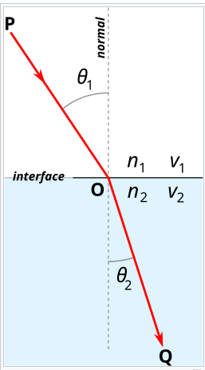
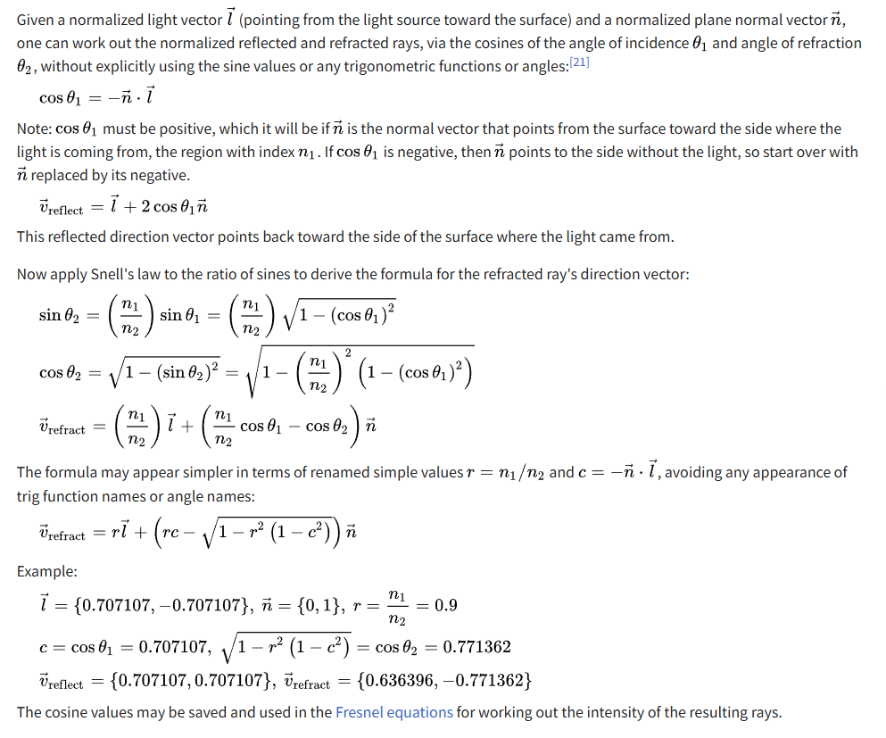
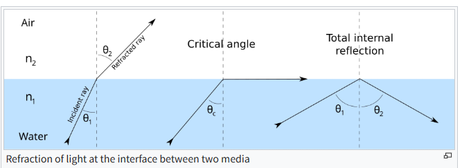

```c++
#include <cmath>
#include <iostream>
#include <vector>
#include "geometry.h"

#define STB_IMAGE_WRITE_IMPLEMENTATION
#define M_PI 3.141592653589793238462643383279502884

#include "stb_image_write.h"

struct Light
{
    Light(const Vec3f &p, const float &i) : position(p), intensity(i)
    {
    }

    Vec3f position;
    float intensity;
};

struct Material
{
    Material(const float &r, const Vec4f &a, const Vec3f &color, const float &spec) : refractive_index(r), albedo(a),
        diffuse_color(color), specular_exponent(spec)
    {
    }

    Material() : refractive_index(1), albedo(1, 0, 0, 0), diffuse_color(), specular_exponent()
    {
    }

    float refractive_index;
    Vec4f albedo;
    Vec3f diffuse_color;
    float specular_exponent;
};

Vec3f reflect(const Vec3f &I, const Vec3f &N)
{
    return I - N * 2.f * (I * N);
}

Vec3f refract(const Vec3f &I, const Vec3f &N, const float &refractive_index)
{
    // Snell's law
    float cosi = -std::max(-1.f, std::min(1.f, I * N));
    float etai = 1, etat = refractive_index;
    Vec3f n = N;
    if (cosi < 0)
    {
        // if the ray is inside the object, swap the indices and invert the normal to get the correct result
        cosi = -cosi;
        std::swap(etai, etat);
        n = -N;
    }
    float eta = etai / etat;
    float k = 1 - eta * eta * (1 - cosi * cosi);
    return k < 0 ? Vec3f(0, 0, 0) : I * eta + n * (eta * cosi - sqrtf(k));
}

struct Sphere
{
    Vec3f center;
    float radius;
    Material material;

    Sphere(const Vec3f &c, const float &r, const Material &m) : center(c), radius(r), material(m)
    {
    }

    bool ray_intersect(const Vec3f &orig, const Vec3f &dir, float &t0) const
    {
        Vec3f L = center - orig;
        float tca = L * dir;
        float d2 = L * L - tca * tca;
        if (d2 > radius * radius) return false;
        float thc = sqrtf(radius * radius - d2);
        t0 = tca - thc; // 射线与球体的第一个交点
        float t1 = tca + thc; // 射线与球体的第二个交点
        if (t0 < 0) t0 = t1;
        if (t0 < 0) return false;
        return true;
    }
};

bool scene_intersect(const Vec3f &orig, const Vec3f &dir, const std::vector<Sphere> &spheres, Vec3f &hit, Vec3f &N,
                     Material &material)
{
    float spheres_dist = std::numeric_limits<float>::max();
    for (size_t i = 0; i < spheres.size(); i++)
    {
        float dist_i;
        if (spheres[i].ray_intersect(orig, dir, dist_i) && dist_i < spheres_dist) // 找到更近的交点 相当于深度测试
        {
            spheres_dist = dist_i;
            hit = orig + dir * dist_i;
            N = (hit - spheres[i].center).normalize();
            material = spheres[i].material;
        }
    }
    return spheres_dist < 1000;
}

Vec3f cast_ray(const Vec3f &orig, const Vec3f &dir, std::vector<Sphere> &spheres, const std::vector<Light> &lights,
               size_t depth = 0)
{
    Vec3f point, N;
    Material material;

    if (depth > 4 || !scene_intersect(orig, dir, spheres, point, N, material))
    {
        return Vec3f(0.2, 0.7, 0.8); // background color
    }

    // mirror reflection
    Vec3f reflect_dir = reflect(dir, N).normalize();
    // offset the original point to avoid occlusion by the object itself
    Vec3f reflect_orig = reflect_dir * N < 0 ? point - N * 1e-3 : point + N * 1e-3;
    Vec3f reflect_color = cast_ray(reflect_orig, reflect_dir, spheres, lights, depth + 1);

    // refraction
    Vec3f refract_dir = refract(dir, N, material.refractive_index).normalize();
    Vec3f refract_orig = refract_dir * N < 0 ? point - N * 1e-3 : point + N * 1e-3;
    Vec3f refract_color = cast_ray(refract_orig, refract_dir, spheres, lights, depth + 1);

    float diffuse_light_intensity = 0;
    float specular_light_intensity = 0;
    for (int i = 0; i < lights.size(); i++)
    {
        Vec3f light_direction = (lights[i].position - point).normalize();

        // shadow check
        float light_distance = (lights[i].position - point).norm();
        Vec3f shadow_orig = light_direction * N < 0 ? point - N * 1e-3 : point + N * 1e-3;
        // checking if the point lies in the shadow of the lights[i]
        Vec3f shadow_pt, shadow_N;
        Material tmpmaterial;
        if (scene_intersect(shadow_orig, light_direction, spheres, shadow_pt, shadow_N, tmpmaterial) && (
                shadow_pt - shadow_orig).norm() < light_distance)
            continue;

        // Blin-Phong illumination model
        diffuse_light_intensity += lights[i].intensity * std::max(0.f, light_direction * N);

        Vec3f view_direction = (orig - point).normalize();
        Vec3f half_vector = (light_direction + view_direction).normalize();
        specular_light_intensity += lights[i].intensity * powf(std::max(0.f, half_vector * N),
                                                               material.specular_exponent);
    }

    return material.diffuse_color * diffuse_light_intensity * material.albedo[0]
           + Vec3f(1., 1., 1.) * specular_light_intensity * material.albedo[1]
           + reflect_color * material.albedo[2] + refract_color * material.albedo[3];
}

void render(std::vector<Sphere> objects, const std::vector<Light> &lights, char const *filename = "output.png")
{
    const int width = 1024;
    const int height = 768;
    const int fov = M_PI / 2.;
    std::vector<Vec3f> framebuffer(width * height); // Frame buffer to hold pixel colors

#pragma omp parallel for
    for (size_t j = 0; j < height; j++)
    {
        for (size_t i = 0; i < width; i++)
        {
            float x = (2 * (i + 0.5) / (float) width - 1) * tan(fov / 2.) * width / (float) height;
            float y = -(2 * (j + 0.5) / (float) height - 1) * tan(fov / 2.);
            Vec3f dir = Vec3f(x, y, -1).normalize();
            framebuffer[i + j * width] = cast_ray(Vec3f(0, 0, 0), dir, objects, lights);
        }
    }

    // 转换为 8-bit RGB 图像数据
    std::vector<unsigned char> image(3 * width * height);
    for (int j = 0; j < height; j++)
    {
        for (int i = 0; i < width; i++)
        {
            Vec3f &c = framebuffer[i + j * width];
            image[3 * (i + j * width) + 0] = (unsigned char) (255 * std::max(0.f, std::min(1.f, c.x)));
            image[3 * (i + j * width) + 1] = (unsigned char) (255 * std::max(0.f, std::min(1.f, c.y)));
            image[3 * (i + j * width) + 2] = (unsigned char) (255 * std::max(0.f, std::min(1.f, c.z)));
        }
    }

    // comp == 3 ==> RGB image
    if (stbi_write_png(filename, width, height, 3, image.data(), width * 3))
        std::cout << "successfully write image: " << filename << std::endl;
    else
        std::cout << "failed to write image!" << std::endl;
}

int main()
{
    Material ivory(1.0, Vec4f(0.6, 0.3, 0.1, 0.0), Vec3f(0.4, 0.4, 0.3), 50.);
    Material glass(1.5, Vec4f(0.0, 0.5, 0.1, 0.8), Vec3f(0.6, 0.7, 0.8), 125.);
    Material red_rubber(1.0, Vec4f(0.9, 0.1, 0.0, 0.0), Vec3f(0.3, 0.1, 0.1), 10.);
    Material mirror(1.0, Vec4f(0.0, 10.0, 0.8, 0.0), Vec3f(1.0, 1.0, 1.0), 1425.);

    std::vector<Sphere> spheres;
    spheres.push_back(Sphere(Vec3f(-3, 0, -16), 2, ivory));
    spheres.push_back(Sphere(Vec3f(-1.0, -1.5, -12), 2, glass));
    spheres.push_back(Sphere(Vec3f(1.5, -0.5, -18), 3, red_rubber));
    spheres.push_back(Sphere(Vec3f(7, 5, -18), 4, mirror));

    std::vector<Light> lights;
    lights.push_back(Light(Vec3f(-20, 20, 20), 1.5));
    lights.push_back(Light(Vec3f(30, 50, -25), 1.8));
    lights.push_back(Light(Vec3f(30, 20, 30), 1.7));

    render(spheres, lights);
    return 0;
}

```
------

## 一、核心思想：递归光线追踪中的反射与折射

当相机射出一条光线（ray）与场景中的物体相交时，我们并不直接结束计算，而是：

1. 根据物体的材质，计算局部光照（漫反射 + 高光）。
2. 如果材质是**镜面**的，就沿反射方向再发射一条新光线；
3. 如果材质是**透明**的（玻璃、水），就沿折射方向再发射一条光线；
4. 最后将这些分量按照材质的 **albedo（反照率）** 混合，得到最终颜色。

------

##  二、反射（Reflection）

### 1. 原理

反射方向遵循**反射定律**：
 入射角 = 反射角，方向位于法线所在平面内。

数学表达式：
$$
R = I - 2 (I \cdot N) N
$$
其中：

- (I)：入射方向（**指向表面**）
- (N)：法线方向（**表面指向外部**）
- (R)：反射方向

### 2. 代码实现

```cpp
Vec3f reflect(const Vec3f &I, const Vec3f &N) {
    return I - N * 2.f * (I * N);
}
```

- `I * N` 表示入射光线与法线的点积（即入射方向在法线方向上的投影）。
- `2 * (I * N) * N` 就是这部分向量的“反弹”。
- 最终结果是从法线反向反射回去的向量。

### 3. 在递归中的使用

```cpp
Vec3f reflect_dir = reflect(dir, N).normalize();
Vec3f reflect_orig = reflect_dir * N < 0 ? point - N * 1e-3 : point + N * 1e-3;
Vec3f reflect_color = cast_ray(reflect_orig, reflect_dir, spheres, lights, depth + 1);
```

解释：

- `reflect_dir`：反射光线方向；
- `reflect_orig`：光线起点略微偏移一点点（`1e-3`），防止浮点误差造成“自相交”（Self-intersection）。
- 然后递归调用 `cast_ray()` 沿反射方向发射一条新光线，直到打到下一个物体或到达背景。

------

## 三、折射（Refraction）

### 1. 原理

折射遵循**斯涅尔定律 (Snell’s Law)**：
$$
\eta_i \sin \theta_i = \eta_t \sin \theta_t
$$
其中：

- ($\eta_i$)：入射介质折射率（如空气 = 1）
- ($\eta_t$)：目标介质折射率（如玻璃 ≈ 1.5）
- ($\theta_i$)：入射角
- ($\theta_t$)：折射角



折射方向公式：
$$
T = \eta I + (\eta \cos\theta_i - \cos\theta_t) N
$$
 其中
$$
\cos\theta_t = \sqrt{1 - \eta^2 (1 - \cos^2\theta_i)}
$$


### 2. 代码实现分析

```cpp
Vec3f refract(const Vec3f &I, const Vec3f &N, const float &refractive_index)
{
    float cosi = -std::max(-1.f, std::min(1.f, I * N));
    float etai = 1, etat = refractive_index;
    Vec3f n = N;
    if (cosi < 0)
    {
        cosi = -cosi;
        std::swap(etai, etat);
        n = -N;  // 从内部射出时翻转法线
    }
    float eta = etai / etat;
    float k = 1 - eta * eta * (1 - cosi * cosi);
    return k < 0 ? Vec3f(0, 0, 0) : I * eta + n * (eta * cosi - sqrtf(k));
}
```

详细逻辑：

1. **计算 cosi**：入射角与法线夹角的余弦。
2. **判断是否在物体内部**：如果 `cosi < 0`，说明光线是从内部往外射出，于是交换介质折射率、翻转法线。
3. **计算相对折射率 eta = etai / etat**。
4. **计算判别式 k = 1 - eta²(1 - cosi²)**：
   - 若 `k < 0`，说明发生了**全反射**（折射光不存在）。



5. **计算折射方向**：
   `I * eta + n * (eta * cosi - sqrtf(k))`

### 3. 在递归中的使用

```cpp
Vec3f refract_dir = refract(dir, N, material.refractive_index).normalize();
Vec3f refract_orig = refract_dir * N < 0 ? point - N * 1e-3 : point + N * 1e-3;
Vec3f refract_color = cast_ray(refract_orig, refract_dir, spheres, lights, depth + 1);
```

这段与反射几乎相同：

- 计算折射方向；
- 偏移起点以避免自遮挡；
- 递归发射新的光线（穿透物体内部后继续传播）。

------

## 四、反射与折射的混合与递归

最终颜色混合如下：

```cpp
return material.diffuse_color * diffuse_light_intensity * material.albedo[0]
       + Vec3f(1., 1., 1.) * specular_light_intensity * material.albedo[1]
       + reflect_color * material.albedo[2]
       + refract_color * material.albedo[3];
```

### 各通道含义

| albedo 分量 | 含义         | 对应部分            |
| ----------- | ------------ | ------------------- |
| `[0]`       | 漫反射系数   | 物体颜色 × 光照强度 |
| `[1]`       | 高光反射系数 | Blinn-Phong 高光    |
| `[2]`       | 镜面反射比例 | 递归反射光颜色      |
| `[3]`       | 折射比例     | 递归折射光颜色      |

### 递归限制

`depth > 4` 时终止递归，防止无限循环。

------

##  五、总结流程（每条光线）

1. 从相机发出一条光线；
2. 找到最近的物体交点；
3. 在交点计算：
   - **漫反射 + 高光**（Blinn-Phong）；
   - **反射光线** → cast_ray 递归；
   - **折射光线** → cast_ray 递归；
4. 按材质 `albedo` 加权混合；
5. 若无交点，则返回背景色；
6. 最终结果存入 framebuffer。

------

## 额外说明：玻璃球的视觉效果

当你渲染 `glass` 球体时：

- 一部分光线被反射；
- 一部分光线被折射进入球体；
- 折射光线在内部又被反射、折射，层层递归；
   最终在画面上形成**透明 + 高光 + 反射背景**的真实玻璃质感。
